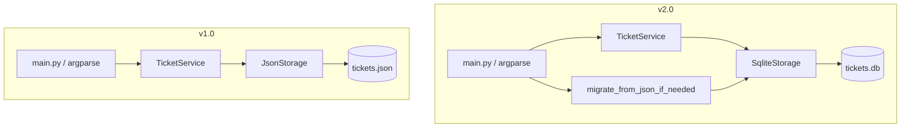

# README.md

# 工廠維修工單管理系統

## 1. 專案簡介

本專案是一套以 CLI 為核心的工廠維修工單管理系統，主題設定聚焦於產線異常回報、停機追蹤、維修備註與維修優先序建議，v1.0 的設計動機是將傳統以口頭回報、紙本紀錄或零散文字檔處理的維修資訊，改為可查詢、可追蹤、可排序的數位化工單流程，v1.0 主要以 JSON 作為儲存方式，適合快速建立可方便執行。

從 v1.0 演化到 v2.0 的過程中，將系統目標從「工單紀錄工具」提升為「可支援設備健康度分析與條件化管理查詢的維修系統」，v2.0 在不移除 v1.0 指令的前提下，新增了正式結案欄位、設備健康度彙整、帶條件的摘要查詢、CSV 匯出以及 JSON → SQLite 的自動遷移機制，讓系統更接近真實工廠環境中的管理需求。

---

## 2. v1.0 設計決策

該節說明設計 v1.0 時，如何預先保留未來擴充空間，確保 v1.0 留有可擴充的完整結構，為 v2.0的所有需求做準備。

- **選擇 `argparse` 作為 CLI 解析工具，而不是直接手寫 `sys.argv`**  
  於 v1.0 使用 `argparse` 建立子指令結構，因為它原生支援 `subparsers`，很適合讓系統日後持續擴充新指令而不破壞既有命令格式，這也讓 v2.0 可以直接延伸出 `machine`、`export`、條件式 `summary` 與結案相關參數，而不用推翻整個 CLI 入口。

- **將資料存取抽象成 `BaseStorage`，而不是把 JSON 讀寫直接寫死在主程式**  
  v1.0 雖然實際使用的是 `JsonStorage`，但我先定義了 `BaseStorage` 介面，讓 `TicketService` 依賴抽象而不是依賴特定檔案格式，該設計在 v2.0 很重要，因為我可以把底層改成 `SqliteStorage`，而服務層大多保留原有邏輯，這是整份作業中最核心的前瞻設計forward-looking design。

- **將業務邏輯集中在 `TicketService`，而不是散落在 CLI 分支裡**  
  v1.0 的 `create_ticket`、`list_tickets`、`update_ticket`、`search_tickets`、`get_summary`、`add_note`、`recommend_tickets` 都在 `TicketService` 中，設計理由是：CLI 只負責解析輸入與輸出格式，真正的商業規則只維護一份，後續新增條件查詢、結案規則、頻率加權時，就不需在 `main()` 裡重複撰寫邏輯。

- **資料模型中保留 `metadata` 欄位，並以 `notes` 作為巢狀擴充空間**  
  v1.0 的 `Ticket` 雖然只有基本工單欄位，但我保留 `metadata`，並將維修日誌 `notes` 放入其中，該設計的好處是後續若要新增更多補充資訊，例如責任班別、零件追蹤、外部廠商資訊、備註等，不需要破壞既有欄位結構。

- **一開始就將 `search` 設計為可搜尋 issue 與 note，而不是只搜尋問題描述**  
  考量真實工廠情境，現場的關鍵資訊不一定都出現在初始報修描述，有些故障特徵或維修線索是後續備註才補上，v1.0 的搜尋邏輯就已支援 issue 與 notes，因此 v2.0 在功能延伸時不需要重新定義搜尋邏輯。

- **在 v1.0 中就提供 `recommend`，先建立「排序是可計算的」概念**  
  v1.0 的推薦分數只根據優先級與停機時間計算，將該邏輯演算法做成獨立功能，而非使用者自行判斷，預留 v2.0 進一步導入設備歷史故障頻率、健康度與預防性維護概念的空間。

- **使用 `questionary` 建立 `wizard`，而不是只保留純命令列參數輸入**  
  我在 v1.0 已把互動式引導納入核心功能，因為工廠現場人員不一定熟悉完整 CLI 參數，該設計在 v2.0 變得更有價值，因為可以將 `wizard` 從「報修精靈」擴充成「報修 / 結案雙流程」。

- **使用 `rich` 做視覺化輸出，而非純 `print()`**  
  v1.0 的 `list`、`summary`、`show`、`recommend` 都採用 rich Table / Panel，這不是單純美觀，而是因為維修工單本身具有優先序、狀態與停機風險，適合用色彩與版面層級輔助判讀，讓 v2.0 在加入設備報表與正式結案資訊後，仍能沿用原本的顯示策略。

---

## 3. v2.0 實作說明

了解 v2.0 需求後，先將內容拆成四類：第一類是「修改既有流程」的需求，例如結案不再只是單純更新 `status`；第二類是「新增分析能力」的需求，例如設備健康度追蹤；第三類是「新增條件化查詢」的需求，例如 `summary --line_id --start_date --end_date`；第四類是「新增對外輸出能力」的需求，也就是 CSV 匯出，分析需求幫助我把 PRD 對應到既有的 `TicketService`、`Storage` 與 `main()` 分工，而非零散地直接改 parser。

將 v2.0 的需求對應到實作時，遵循的原則是：**能在原模組上擴充就不新開太多結構，能保留欄位語意就不任意改名，能把新需求收斂到服務層就不讓 `main()` 過度膨脹，** 因此 v2.0 雖然功能比 v1.0 多，但仍維持「CLI → Service → Storage → Output」的基本結構。

以下列出幾個**非顯而易見的實作選擇**：

- **選擇將 JSON 升級為 SQLite，而非僅用 JSON 擴充欄位**  
  升級後讓 v2.0 出現了條件式 summary、設備歷史統計、結案資訊與 CSV 匯出需求，當資料進一步結構化後，SQLite 比 JSON 更適合做條件查詢、欄位升級與資料一致性維護，而且不需要獨立的資料庫伺服器，對傳統工廠環境更實用。

- **保留 `resolution` 欄位名稱，而非新增欄位**  
  我在 v2.0 仍使用 `resolution` 表示結案處置描述，原因是 v1.0 已有這個欄位，可避免只因語意精修而造成不必要的 breaking change，另一方面，v2.0 再額外新增 `actual_repair_minutes` 與 `closed_at`，把正式結案所需資訊補齊。

- **把結案視為業務規則，而非單純欄位更新**  
  在 `update_ticket()` 中，我特別將 `status == "closed"` 視為一個獨立邏輯分支，強制要求 `actual_repair_minutes` 與 `resolution` 必填，並在結案時自動寫入 `closed_at`，目的是讓「closed」不再只是狀態字串，而是一個完整的工單生命週期節點。

- **將設備健康度改為從工單動態彙整，而非建立設備主檔表**  
  PRD 明確表示不一定需要獨立設備資料表，因此我在 v2.0 中選擇從既有工單紀錄動態彙整 `machine_id` 的歷史工單總數、狀態分布、累積停機、常見故障類型與近 90 天頻率，讓設計可以降低資料冗餘，也避免在作業規模下過度設計。

- **推薦公式導入 `recent_count * 15` 的加權，而非直接使用全歷史總數**  
  我將設備近期故障頻率定義為近 90 天工單數，並在 `recommend_tickets()` 中加到原本的 priority + downtime 分數上，相比用過去歷史總數更能反映「近期慣性故障」的風險，而權重 15 的設計是為了讓每次近期故障有實質影響，但又不會瞬間完全壓過工單本身的 priority 與 downtime。

- **CSV 匯出的 notes 採用單欄扁平化設計**  
  由於 CSV 是扁平結構，無法直接保存 list 型態，因此我將多筆 note 匯整於單一 `notes` 欄位中，並以換行作為不同備註之分隔方式，在 Excel 中開啟時，同一儲存格仍保有好的可讀性。

- **沒有額外建立 `migrate.py`，而是整合為自動遷移函式**  
  雖然作業規範示例提到可以有 `migrate.py`，但我評估目前專案規模較小，因此把遷移邏輯整合到 `main()` 啟動流程中，以 `migrate_from_json_if_needed()` 自動檢查是否需要執行，此作法優點是使用者在升級時不必多記一條命令，也更符合「不中斷升級」的思路。

---

## 4. 向下相容性實作細節

v2.0 的實作核心，不是「新增很多功能」，而是「在不破壞 v1.0 介面的前提下，讓系統承載更多資訊與流程」，課程規範也明確要求 v2.0 必須承接 v1.0 CLI 指令與測試案例，並強調向下相容是設計重點。

實作上採取以下相容策略：

- **保留所有 v1.0 指令名稱**  
  `wizard`、`report`、`list`、`update`、`show`、`summary`、`search`、`note`、`recommend`、`delete` 全部保留，v2.0 只額外新增 `machine` 與 `export`。

- **保留 v1.0 常見參數與輸出語意**  
  例如 `report` 仍接受 `--machine_id --line_id --issue --failure_type --priority --downtime_minutes`；`list` 仍支援排序與狀態過濾；`note` 仍是依工單 ID 追加帶時間戳記的備註，使得 v1.0 的使用方式在 v2.0 中仍成立。

- **以 `BaseStorage` 作為適配層（Adapter-like role）**  
  雖然未明確命名為 Adapter Pattern，但實作上 `BaseStorage` 扮演了適配層的角色：v1.0 的 `TicketService` 原本依賴 `JsonStorage`，到了 v2.0 則可切換為 `SqliteStorage`，而 service 的呼叫介面大致不變，讓「資料儲存方式改變」不會擴散成整個系統的破壞性修改。

- **以欄位延伸取代欄位改名**  
  v2.0 並沒有把 `resolution` 改成全新名字，而是保留原欄位再新增 `actual_repair_minutes` 與 `closed_at`，讓舊資料仍可被讀取，語意也較容易延續。

- **用自動遷移保住舊資料，而不是要求使用者手動轉檔**  
  若同目錄下有 v1 的 `tickets.json`，且 SQLite 尚未有資料，系統會在首次啟動時自動匯入舊資料並備份原檔，相比要求使用者自己撰寫轉換腳本，更符合升級時的實務性。

- **對舊資料中不存在的新欄位採保守處理**  
  例如由 v1 遷移進來的已結案工單，若原本沒有 `closed_at`，則系統以空值保存，顯示時再轉換為「未記錄」，不虛構歷史時間，因為資料完整性與可追溯性比表面完整更重要。

---

## 5. 架構演化比較

| 面向 | v1.0 | v2.0 |
|---|---|---|
| 儲存層 | JSON 檔案 `tickets.json` | SQLite `tickets.db` |
| CLI Library | argparse | argparse |
| 互動輸入 | questionary（報修） | questionary（報修 + 結案） |
| 顯示層 | rich Table / Panel | rich Table / Panel / Group |
| 服務層 | TicketService 基本 CRUD + 搜尋 + 摘要 + 推薦 | TicketService 擴充正式結案、設備健康度、條件統計、匯出 |
| 資料模型 | `Ticket` + `metadata.notes` | `Ticket` + `resolution` + `actual_repair_minutes` + `closed_at` + `metadata.notes` |
| 搜尋能力 | issue + notes | issue + machine_id + line_id + failure_type + resolution + notes |
| 推薦邏輯 | priority + downtime | priority + downtime + recent 90-day failure count |
| 摘要統計 | 全量 summary | 支援 `--line_id --start_date --end_date` |
| 新增指令 | 無 | `machine`、`export` |
| 遷移機制 | 不適用 | JSON → SQLite 自動遷移 |
| 程式碼文件化 | 基本註解與函式切分 | 補充 docstring 與更清楚的分層說明 |

### 架構圖對比（概念）


本圖展示系統儲存層從 JSON 檔案 演進至 SQLite 關係型資料庫 的升級過程，透過 v1.0 預留的 BaseStorage 抽象介面，v2.0 成功實作儲存引擎的『非破壞性替換』，確保核心業務邏輯 (TicketService) 在架構升級中維持穩定，此外，新增的 Auto-Migrator 流程確保舊有維修數據的銜接，展現了軟體生命週期中『營運不中斷』的實務考量。

## 6. 環境需求與執行方式

### 環境需求
為了確保系統能在工廠終端機環境穩定運行並提供高品質的互動體驗，本專案建議在以下環境配置下執行：

- Python 版本：建議使用 Python 3.10 +

- 外部核心套件：

  - rich (>=13.0.0)：本專案的 視覺化管理 (Visual Management) 核心，負責在終端機實作「數位看板」，透過色彩編碼（例如：紅色高亮 high 優先級、綠色標示 closed 狀態）與結構化表格（Table）、面板（Panel），大幅縮短管理人員辨識異常與解讀報表的時間。

  - questionary (>=2.0.0)：落實 防錯設計 (Poka-yoke) 的關鍵工具，透過引導式選單與即時輸入驗證（如：停機時間強制限定數字），從資料源頭防止因鍵盤輸入錯誤或拼寫不一導致的數據污染，確保系統產出的數據具備 100% 的可信度。
- v2.0 內建標準庫應用：

  - sqlite3：提供 ACID 事務級別的資料持久化，相較於 JSON 檔案，更適合處理頻繁的讀寫操作並確保資料完整性。

  - csv / json：負責與企業其他系統（如 ERP/MES）對接的資料交換格式處理。

  - shutil：用於執行系統升級時的資料自動遷移與原檔安全備份。

### 安裝步驟
本專案已將相依套件整理至 requirements.txt 中，請於專案根目錄下執行以下指令完成環境配置：
```bash
pip install -r requirements.txt
```

### 執行與常用指令
本系統採模組化設計，進入各版本資料夾後即可啟動服務：
- 版本 v1.0 (基礎數位報修)
```bash
cd v1/
python main.py wizard
```

- 版本 v2.0 (演進分析版本)
系統具備自動遷移（Auto-migration）策略：首次啟動時若偵測到與 `v2/main.py` 同目錄的舊版 `tickets.json，會自動將歷史資料匯入 SQLite 並備份舊檔。
```bash
cd v2/
python main.py --help
```

- 常用專業管理指令範例

| 管理目標 | 指令範例 |
| --- | --- |
| Poka-yoke 報修/結案 | `python main.py wizard`|
| 依停機風險排序 | `python main.py list --sort downtime`|
| 完成結案程序 | `python main.py update --id 1 --status closed --actual_repair_minutes 45 --resolution "更換主軸軸承"`|
| 單機健康度報表 | `python main.py machine --machine_id M101`|
| 產線週期統計摘要 | `python main.py summary --line_id L2 --start_date 2026-03-01 --end_date 2026-03-31`|
| 離線管理數據匯出 | `python main.py export --status closed --line_id L2`|

## 7. 已知限制與未來改進方向
目前 v2.0 版本已完整實作需求規格書中的所有指標，但在追求極致工業級穩定性的過程中，仍可思考以下改進點：

- 當前限制與技術瓶頸
  - 缺乏自動化回歸測試：目前驗證仍依賴手動執行測試案例，隨功能擴充，手動驗證 v1 與 v2 相容性的成本將大幅上升，容易忽略邊界錯誤。

  - 設備健康評分權重固定：目前的加權係數（15 分）為管理啟發式規則，尚未與真實的設備 MTBF (平均失效間隔) 與 MTTR (平均修復時間) 進行統計關聯。

  - CSV 格式互通性：匯出功能目前以人類可讀性為主，若要與生產管理軟體（如 CMMS）自動對接，仍需進一步定義嚴謹的日期標準與欄位 Meta-data。

- v3.0 發展方向 

    若有後續開發計畫，將優先投入以下專業領域：

  - 智慧型檢索介面：優化 search 輸出，顯示「命中欄位 + 關鍵字上下文高亮」，大幅提升技師翻查歷史維修知識的效率。

  - 導入自動化測試框架：利用 pytest 建立全方位的單元測試，確保底層儲存邏輯與 Service 層在後續重構時不發生功能倒退。

  - 設備主資料中心 (Master Data)：新增獨立的設備、備品零件與技師的基本資料表，從工單系統轉型為完整的 EAM (企業資產管理) 雛形。

  - 預防性維護 (PdM) 預測模型：不單以機台故障次數，而是根據累積運行時數與 MTBF 自動在 recommend 列表中提示即將面臨損壞風險的機台。

  - 支援多併發處理：考量多位維修員同時報修的場景，將資料庫層從 SQLite 升級為支援更高併發性能的 PostgreSQL，滿足大規模廠區使用。