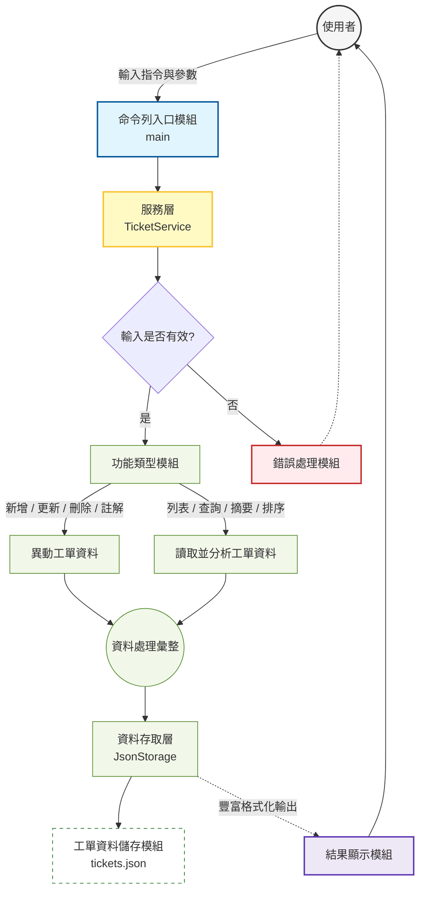

#  工廠維修工單管理系統 - SDD v1.0

## 1. 專案概覽 (Project Overview)
- **程式名稱**：工廠維修工單管理系統 
- **版本**：v1.0
- **一句話描述**：基於生產管理邏輯的維修工單系統，旨在優化產線停機時間與維修優先順序。
- **目標使用者**：產線領班、設備維護工程師、廠務管理員。
- **核心價值**：建立標準且數位化的異常回報系統，透過集中資料管理取代傳統人工紀錄，實現維修資訊透明化並優化行政管理效率。

## 2. CLI 介面規格 (Interface Specification)

| 指令 | 參數 | 說明 | 範例 |
| :--- | :--- | :--- | :--- |
| `wizard` | (無) | 啟動互動式報修精靈，透過選單引導完成報修，落實 Poka-yoke 設計。 | `python v1/main.py wizard` |
| `report` | `--machine_id` `--line_id` `--issue` `--failure_type` `--priority` `--downtime_minutes` | 新增維修工單 | `python v1/main.py report --machine_id M1 --line_id L1 --issue "馬達過熱" --failure_type mechanical --priority high` |
| `list` | `--status` `--sort` | 列出工單（可依 status 過濾，或依 id/priority/downtime 排序） | `python v1/main.py list --status open --sort priority` |
| `update` | `--id` (必填) `--status` `--priority` `--downtime_minutes` | 更新工單狀態或參數 | `python v1/main.py update --id 1 --status closed` |
| `show` | `--id` | 查看特定工單詳細報告與維修備註 | `python v1/main.py show --id 1` |
| `summary` | (無) | 產出工廠異常維護統計報告（含停機總時數、故障分布） | `python v1/main.py summary` |
| `search` | `--keyword` | 關鍵字搜尋工單內容或備註 | `python v1/main.py search --keyword "馬達"` |
| `note` | `--id` `--text` | 為特定工單追加維修紀錄（自動附帶時間戳記） | `python v1/main.py note --id 1 --text "已更換碳刷"` |
| `recommend`| (無) | 輔助參考功能：提供初步的優先級檢視，降低管理者的判讀負擔。 | `python v1/main.py recommend` |
| `delete` | `--id` | 刪除錯誤的工單紀錄 | `python v1/main.py delete --id 1` |

## 3. 資料模型 (Data Model)

### Ticket (工單模型)
| 欄位 | 型別 | 說明 | 必填 |
| :--- | :--- | :--- | :--- |
| `id` | int | 唯一識別碼，自動遞增 | ✅ |
| `machine_id` | str | 故障設備代碼 | ✅ |
| `line_id` | str | 產線代碼 | ✅ |
| `issue` | str | 問題描述 | ✅ |
| `failure_type` | enum | 故障類型 (mechanical, electrical, sensor, quality, other) | ✅ |
| `priority` | enum | 優先級 (low, medium, high) | ✅ |
| `status` | enum | 狀態 (open, in_progress, closed) | ✅ |
| `downtime_minutes`| int | 造成的停機分鐘數 | ✅ (預設 0) |
| `metadata` | dict | 擴充欄位，內含 `notes` (維修日誌清單) | ✅ |

## 4. 模組架構 (Module Design)

- **展示層** (Presentation Layer)：

    - **命令列入口模組**：整合 questionary 實作引導式操作，將複雜參數簡化為互動選單，落實 Poka-yoke (防錯設計)。

    - **結果顯示模組**：導入 rich 渲染引擎實現視覺化管理，透過色彩編碼（如紅色標示高優先順序工單）提升資訊辨識速度。

- **服務層** (Service Layer)：完全解析業務邏輯與儲存技術，不論從何種介面輸入，皆透過統一的邏輯單元進行驗證，確保資料一致性。

- **資料存取層** (Data Access Layer)：透過介面分隔具體儲存實作，確保系統具備高度的擴充彈性，為後續資料庫遷移打下基礎。

## 5. 錯誤處理規格 (Error Handling)

| 情境 | 預期行為 | 退出碼 |
| :--- | :--- | :--- |
| 找不到指定 ID | 輸出 `Error: Ticket not found` | 1 |
| 參數驗證失敗 | 輸出 `Error: invalid [field] / must be >= 0` | 2 |
| 資料讀取失敗 | 輸出 `Error: failed to read data file` | 1 |

## 6. 測試案例 (Test Cases)

本清單包含基本功能驗證、生管排序邏輯驗證與錯誤測試，確保系統的適用性。

| # | 測試情境 | 輸入指令 | 預期輸出結果 | 通過條件 |
| :-- | :--- | :--- | :--- | :--- |
| 1 | **互動式報修 (Wizard)** | `python v1/main.py wizard` | 出現引導式選單（產線、類型、優先級） | 完成對話並產生新 ID |
| 2 | **視覺化看板 (Rich)** | `python v1/main.py list` | 以 **彩色格線表格** 顯示工單，High 優先級顯示紅色 | 格式美觀且顏色正確 |
| 3 | **統計面板 (Panel)** | `python v1/main.py summary` | 數據包覆在藍色 **Panel (面板)** 框線中 | 面板正確渲染且數據無誤 |
| 4 | **指令報修 (CLI)** | `python v1/main.py report --machine_id M1 --line_id L1 --issue "馬達過熱" --failure_type mechanical --priority high` | `SUCCESS: Reported Ticket [ID]` | 確保快速指令模式向下相容 |
| 5 | **狀態過濾測試** | `python v1/main.py list --status open` | 僅列出狀態為 `open` 的工單表格 | 內容過濾正確且退出碼 0 |
| 6 | **停機排序測試** | `python v1/main.py list --sort downtime` | 依停機時間由大到小降序排列 | 排序邏輯正確 |
| 7 | **新增維修備註** | `python v1/main.py note --id 1 --text "更換培林完成"` | `SUCCESS: Note added` | 備註成功存入並帶有時間戳記 |
| 8 | **關鍵字全文搜尋** | `python v1/main.py search --keyword "培林"` | 檢索出 issue 或備註中含「培林」之工單 | 搜尋結果無遺漏 |
| 9 | **生管維修建議邏輯**| `python v1/main.py recommend` | 產出帶有權重評分 (Score) 之修復建議清單 | Score 最高的工單排在首位 |
| 10 | **互動防錯 (Poka-yoke)** | 在 wizard 模式的「停機時間」輸入英文 | 系統即時提示 `Invalid input` 並要求重新輸入 | **防錯機制攔截成功** |
| 11 | **無效類別測試** | `python v1/main.py report --machine_id M2 --line_id L1 --issue "Test" --failure_type software --priority low` | `Error: invalid failure type 'software'` | 退出碼 2 |
| 12 | **負數停機測試** | `python v1/main.py update --id 1 --downtime_minutes -10` | `Error: downtime must be >= 0` | 退出碼 2 |
| 13 | **不存在 ID 測試** | `python v1/main.py show --id 9999` | `Error: Ticket not found` | 退出碼 1 |

## 7. 第三方套件整合說明 (Third-party Integration)
- **Rich (視覺化管理工具)** ：負責終端機的高級渲染，透過色彩編碼與結構化布局，縮短管理人員對重要異常（如 High Priority）的辨識時間，落實工業工程中的管理原則。

- **Questionary (互動式防錯工具)** ：建立 Poka-yoke 引導流程，透過固定選項取代手動字串輸入，從源頭消除因拼字錯誤或格式不符導致的資料輸入錯誤問題，確保數據一致性。