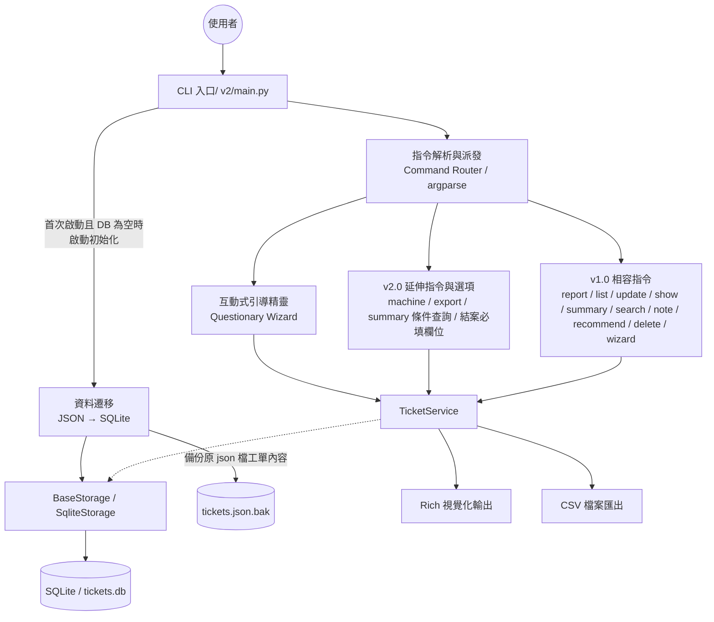
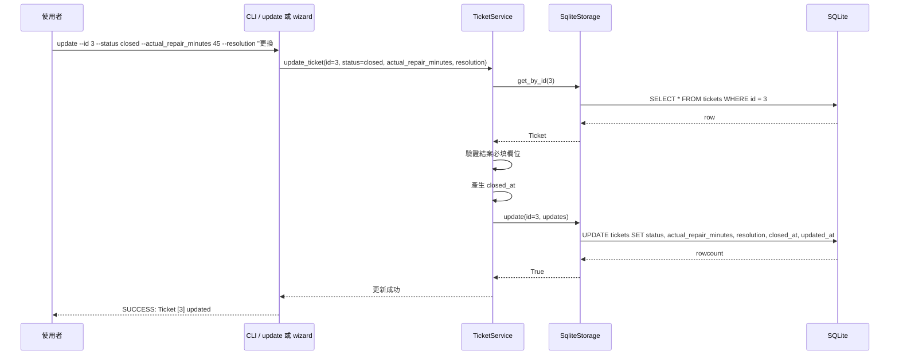
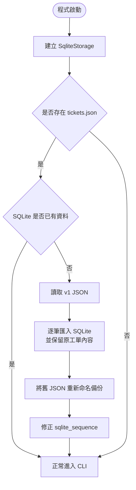

# 工廠維修工單管理系統 - SDD v2.0

## 1. 專案概覽（Project Overview）
- **程式名稱**：工廠維修工單管理系統
- **版本**：v2.0
- **一句話描述**：以工廠設備維護與生產管理為核心的 CLI 工單系統，在保留 v1.0 指令介面的前提下，新增結案生命週期、設備歷史資訊追蹤、條件式統計查詢與 CSV 匯出功能。
- **目標使用者**：產線管理者、設備維護工程師、廠務管理員、生管人員。
- **核心價值**：
  1.使工單不再只是單次報修紀錄，而是可追蹤、可統計、可輸出的設備維護資料。
  2.透過 SQLite 取代 v1.0 的 JSON 單檔儲存，提高條件查詢、歷史統計與匯出整合能力。
  3.在不破壞 v1.0 使用方式的前提下，逐步導入更接近真實工廠情境的維修管理機制。

---

## 2. CLI 介面規格（Interface Specification）

### 指令總覽

| 指令 | 參數 | 說明 | 範例 |
| :--- | :--- | :--- | :--- |
| `wizard` | (無) | 啟動互動式精靈，支援建立新工單或引導結案 | `python v2/main.py wizard` |
| `report` | `--machine_id`<br>`--line_id`<br>`--issue`<br>`--failure_type`<br>`--priority`<br>`--downtime_minutes` | 建立新工單 | `python v2/main.py report --machine_id M1 --line_id L1 --issue "馬達過熱" --failure_type mechanical --priority high --downtime_minutes 20` |
| `list` | `--status`<br>`--line_id`<br>`--sort` | 列出工單，可依狀態、產線過濾，並依欄位排序 | `python v2/main.py list --status open --line_id L2 --sort priority` |
| `update` | `--id`<br>`--status`<br>`--priority`<br>`--downtime_minutes`<br>`--actual_repair_minutes`<br>`--resolution` | 更新工單。當 `--status closed` 時，必須同時提供結案資訊 | `python v2/main.py update --id 3 --status closed --actual_repair_minutes 45 --resolution "更換 #3 軸承"` |
| `show` | `--id` | 顯示單張工單詳細內容、結案資訊與維修日誌 | `python v2/main.py show --id 3` |
| `summary` | `--line_id`<br>`--start_date`<br>`--end_date` | 顯示帶條件的工單摘要統計 | `python v2/main.py summary --line_id L2 --start_date 2026-03-01 --end_date 2026-03-31` |
| `search` | `--keyword` | 全文檢索，並標示關鍵字命中之欄位來源與摘要 | `python v2/main.py search --keyword "軸承"` |
| `note` | `--id`<br>`--text` | 為工單新增維修日誌備註，附加時間戳記 | `python v2/main.py note --id 1 --text "已通知維修班長到場"` |
| `recommend` | (無) | 根據優先級、停機時間與近期故障頻率，產出維修建議排序 | `python v2/main.py recommend` |
| `delete` | `--id` | 刪除工單 | `python v2/main.py delete --id 9` |
| `machine` | `--machine_id` | 顯示指定設備的歷史維修健康度報表 | `python v2/main.py machine --machine_id M101` |
| `export` | `--status`<br>`--line_id` | 依條件匯出工單為 CSV | `python v2/main.py export --status open --line_id L2` |

### CLI 規格補充
1. **日期格式規範**：`summary` 的日期條件統一採用 `YYYY-MM-DD`。
2. **結案規範**：若 `update` 將工單設為 `closed`，則 `--actual_repair_minutes` 與 `--resolution` 為必填。
3. **向下相容原則**：v1.0 已存在之指令與參數名稱均保留，v2.0 僅新增參數或新指令，不刪除既有行為。

---

## 3. 資料模型（Data Model）

### 3.1 Ticket（工單模型）

| 欄位 | 型別 | 說明 | 必填 |
| :--- | :--- | :--- | :--- |
| `id` | int | 工單唯一識別碼，由 SQLite 自動遞增；遷移舊資料時可保留原 ID | ✅ |
| `machine_id` | str | 故障設備代碼 | ✅ |
| `line_id` | str | 所屬產線代碼 | ✅ |
| `issue` | str | 問題描述 | ✅ |
| `failure_type` | enum | 故障類型，固定為 `mechanical / electrical / sensor / quality / other` | ✅ |
| `priority` | enum | 優先級，固定為 `low / medium / high` | ✅ |
| `status` | enum | 工單狀態，固定為 `open / in_progress / closed` | ✅ |
| `downtime_minutes` | int | 本次事件造成的停機分鐘數 | ✅ |
| `created_at` | str | 建立時間戳記 | ✅ |
| `updated_at` | str | 最近一次更新時間 | ✅ |
| `resolution` | str | 結案處置描述；欄位名稱沿用 v1 以維持相容 | ✅（結案時必填） |
| `actual_repair_minutes` | int / null | 實際維修耗時，僅在結案時填寫 | ✅（結案時必填） |
| `closed_at` | str / null | 正式結案時間 | ❌ 系統自動產生（結案時寫入） |
| `metadata` | dict | 擴充欄位，目前內含 `notes` 維修日誌陣列 | ✅ |

### 3.2 資料表設計（SQLite）

系統使用單一 `tickets` 資料表保存工單資料，結構如下：

| 欄位 | SQLite 型別 | 說明 |
| :--- | :--- | :--- |
| `id` | INTEGER PRIMARY KEY AUTOINCREMENT | 主鍵 |
| `machine_id` | TEXT | 設備代碼 |
| `line_id` | TEXT | 產線代碼 |
| `issue` | TEXT | 問題描述 |
| `failure_type` | TEXT | 故障類型 |
| `priority` | TEXT | 優先級 |
| `status` | TEXT | 工單狀態 |
| `downtime_minutes` | INTEGER | 停機分鐘 |
| `created_at` | TEXT | 建立時間 |
| `updated_at` | TEXT | 更新時間 |
| `resolution` | TEXT | 結案描述 |
| `actual_repair_minutes` | INTEGER | 實際維修時間 |
| `closed_at` | TEXT | 結案時間 |
| `metadata` | TEXT | JSON 字串，保存備註等擴充資料 |

### 3.3 與 v1.0 的資料模型差異
- v1.0 主要著重於報修、查詢與備註管理。
- v2.0 新增 `created_at`、`updated_at`、`actual_repair_minutes`、`closed_at` 等欄位，使工單完整涵蓋從報修到結案的生命週期。
- `resolution` 沿用 v1 欄位名稱，以避免破壞既有資料與輸出邏輯。

---

## 4. 模組架構（Module Design）

### 4.1 v2.0 系統架構圖（Architecture Diagram）


系統架構圖展現系統如何透過 TicketService 作為核心業務中樞，統一處理來自不同入口（CLI 或 Wizard）的請求，並根據需求將數據導向不同的展現層（終端機看板或實體 CSV 檔案）。

---

### 4.2 v2.0 核心流程圖：正式結案流程（Sequence Diagram）


正式結案流程為 v2.0 之核心邏輯，系統透過攔截 status=closed 之請求，強制校驗維修耗時與處置描述之完整性，並透過 TicketService 自動管理生命週期時間戳記，落實資料的可追溯性。

---

### 4.3 工單資料遷移流程圖：v1 JSON → v2 SQLite


---
### 4.4 模組分層說明
- **命令列入口層（CLI Layer）**：由 `main()` 與 `build_parser()` 組成，負責解析子指令與參數。
- **互動式輸入層（Wizard Layer）**：使用 `questionary` 提供建立工單與結案工單的引導流程。
- **服務層（Service Layer）**：`TicketService` 實作工單生命週期、條件統計、設備健康度、搜尋與匯出邏輯。
- **資料存取層（Data Access Layer）**：`BaseStorage` 定義抽象介面，`SqliteStorage` 提供 SQLite 實作。
- **輸出展示層（Presentation Layer）**：透過 `rich` 渲染，針對一般清單使用 `print_ticket_table`，針對搜尋結果則調用 `print_search_table` 以提供來源追蹤資訊。

---

## 5. 錯誤處理規格（Error Handling）

| 情境 | 預期行為 | 退出碼 |
| :--- | :--- | :--- |
| 找不到指定 ID | 輸出 `Error: Ticket not found` | 1 |
| 枚舉值不合法 | 輸出 `Error: invalid [field] 'value'` | 2 |
| 數值欄位為負數 | 輸出 `Error: [field] must be >= 0` | 2 |
| `summary` 日期格式錯誤 | 輸出 `Error: date format must be YYYY-MM-DD` | 2 |
| `summary` 結束日早於起始日 | 輸出 `Error: end_date cannot be earlier than start_date` | 2 |
| 結案未補齊必填欄位 | 輸出 `Error: closing a ticket requires: actual_repair_minutes, resolution`（或缺少欄位清單） | 2 |
| wizard 缺少 `questionary` | 輸出缺少套件訊息並終止 | 1 |
| 匯出無符合資料 | 顯示 `INFO: No matching tickets found. Export cancelled.`，不產生空白 CSV | 0 |

---

## 6. 核心業務邏輯與設計決策（Business Rules & Design Decisions）

### 6.1 正式結案規則
v2.0 不再將 `closed` 視為一般狀態欄位，而是視為一個獨立業務動作：
1. 使用者將工單設為 `closed` 時，必須同時提供：
   - `actual_repair_minutes`
   - `resolution`
2. 系統會自動補上 `closed_at`。
3. `show` 指令會把結案資訊與一般備註分開顯示，避免混淆。

### 6.2 設備健康度與推薦分數
`recommend` 的評分公式定義如下：

$$
Score = PriorityScore + \min(DowntimeMinutes, 60) + 15 \times RecentFailureCount_{90d}
$$

其中：
- `PriorityScore`：`high=100`、`medium=60`、`low=30`
- `DowntimeMinutes`：停機分鐘數，上限 60 分
- `RecentFailureCount_{90d}`：設備近 90 天內工單數量

此設計的目的在於同時考量：
1. **當前事件嚴重度**（priority）
2. **即時生產損失**（downtime）
3. **設備近期重複故障風險**（recent failure count）

`15` 為啟發式權重，用以讓反覆故障設備在排序中獲得足夠重視，符合預防性維護思維。

### 6.3 `summary` 條件查詢規則
- 無條件時，行為與 v1.0 相同，統計全部工單。
- `--line_id` 僅篩選指定產線。
- `--start_date / --end_date` 依 `created_at` 範圍篩選。
- 顯示層透過 `build_query_label()` 明確標示查詢條件。

### 6.4 `export` 欄位順序與備註扁平化設計
CSV 欄位順序設計如下：
1. `id`
2. `machine_id`
3. `line_id`
4. `issue`
5. `failure_type`
6. `priority`
7. `status`
8. `downtime_minutes`
9. `created_at`
10. `updated_at`
11. `actual_repair_minutes`
12. `resolution`
13. `closed_at`
14. `notes`

**設計理由**：
- 前半段以工單識別與現況資訊為主，利於管理者快速篩讀。
- 中段保留時間資訊，便於追溯。
- 結案欄位集中放置，便於後續報表整理。
- `notes` 置於最後，避免備註內容過長影響主要欄位閱讀。

**備註扁平化策略**：
- 系統將 `metadata["notes"]` 內的多筆維修日誌以換行字元串接，保存於單一 `notes` 欄位。
- 該設計兼顧 CSV 扁平結構與 Excel 閱讀性，方便人工閱讀。

### 6.5 舊資料 `closed_at` 為空的處理原則
若 v1.0 遷移而來的舊資料原本不存在 `closed_at`，則 v2.0 保留 `NULL` / 空字串，不主動捏造歷史結案時間，顯示層以「未記錄」表示。此設計符合：
- **資料完整性（Data Integrity）**
- **資料可追溯性（Traceability）**
- **避免遷移時製造虛假時間戳記**

### 6.6 工單關鍵字搜尋(search)結果透明化設計
在 v2.0 開發過程中發現，當關鍵字命中「維修日誌 (notes)」而非「問題描述 (issue)」時，v1.0 的表格輸出會讓使用者誤以為搜尋失效，因此 v2.0 重新設計了資料回傳結構，將搜尋結果封裝為包含 matched_in 與 matched_text 的字典物件，確保資訊的透明度與操作直覺。

---

## 7. 測試案例（Test Cases）

### 7.1 v1.0 相容測試

| # | 測試情境 | 輸入指令 | 預期輸出結果 | 通過條件 |
| :-- | :--- | :--- | :--- | :--- |
| 1 | 互動式報修 | `python v2/main.py wizard` | 可進入建立新工單流程 | 建立成功且產生新 ID |
| 2 | 視覺化看板 | `python v2/main.py list` | 以 Rich 表格顯示工單清單 | 表格正常渲染 |
| 3 | 統計面板 | `python v2/main.py summary` | 顯示面板式摘要報表 | 面板正常渲染且數值正確 |
| 4 | 指令報修 | `python v2/main.py report --machine_id M1 --line_id L1 --issue "馬達過熱" --failure_type mechanical --priority high` | `SUCCESS: Reported Ticket [ID]` | 建立成功 |
| 5 | 狀態過濾測試 | `python v2/main.py list --status open` | 僅列出 `open` 工單 | 過濾正確 |
| 6 | 停機排序測試 | `python v2/main.py list --sort downtime` | 依停機時間由大到小排序 | 排序正確 |
| 7 | 新增維修備註 | `python v2/main.py note --id 1 --text "更換培林完成"` | `SUCCESS: Note added` | 備註成功寫入 |
| 8 | 關鍵字搜尋 | `python v2/main.py search --keyword "培林"` | 搜尋結果應列出命中工單，並顯示命中欄位（如問題描述或備註）與命中內容摘要。 |命中來源與摘要顯示正確，且無遺漏 |
| 9 | 維修建議 | `python v2/main.py recommend` | 產出排序清單 | Score 較高工單排前 |
| 10 | 互動防錯 | wizard 中停機時間輸入英文 | 即時提示錯誤 | 防錯機制生效 |
| 11 | 無效類別測試 | `python v2/main.py report --machine_id M2 --line_id L1 --issue "Test" --failure_type software --priority low` | `Error: invalid failure type 'software'` | 退出碼 2 |
| 12 | 負數停機測試 | `python v2/main.py update --id 1 --downtime_minutes -10` | `Error: downtime must be >= 0` | 退出碼 2 |
| 13 | 不存在 ID 測試 | `python v2/main.py show --id 9999` | `Error: Ticket not found` | 退出碼 1 |

### 7.2 v2.0 延伸需求與驗收測試

| 驗收編號 | 測試情境 | 輸入指令 | 預期結果 |
| :--- | :--- | :--- | :--- |
| A | 結案未提供描述 | `python v2/main.py update --id 1 --status closed --actual_repair_minutes 30` | 拒絕操作，提示缺少 `resolution`，狀態不變 |
| B | 正常結案流程 | `python v2/main.py update --id 1 --status closed --actual_repair_minutes 30 --resolution "更換軸承"` 後再 `show` | `show` 中結案資訊獨立顯示 |
| C | 查詢高歷史工單設備 | `python v2/main.py machine --machine_id M101` | 顯示工單總數、各狀態數、累積停機、常見故障類型 |
| D | 推薦分數受歷史頻率影響 | `python v2/main.py recommend` | 高頻故障設備分數提高，排序靠前 |
| E | 帶產線條件 summary | `python v2/main.py summary --line_id L2` | 標示 `L2 產線`，統計不含其他產線 |
| F | 日期區間錯誤 | `python v2/main.py summary --start_date 2026-12-31 --end_date 2026-01-01` | 顯示錯誤，退出碼非 0 |
| G | 匯出 open 工單 | `python v2/main.py export --status open` | 顯示檔案路徑與筆數，產生 CSV |
| H | 無符合資料匯出 | `python v2/main.py export --status closed --line_id L99` | 顯示取消訊息，不產生空白 CSV |

---

## 8. 向下相容性設計（Backward Compatibility）

### 8.1 保留的 v1.0 介面

| v1.0 指令 | v2.0 行為 | 是否相容 |
|---|---|---|
| `wizard` | 保留原建立工單用途，額外支援結案流程 | ✅ 完全相容 |
| `report --machine_id --line_id --issue --failure_type --priority --downtime_minutes` | 行為不變，內部改為寫入 SQLite | ✅ 完全相容 |
| `list --status --sort` | 行為不變，額外新增 `--line_id` | ✅ 完全相容 |
| `update --id --status --priority --downtime_minutes` | 舊欄位仍可更新；當 `status=closed` 時新增結案必填規則 | ✅ 條件式相容 |
| `show --id` | 行為不變，額外顯示結案資訊區塊 | ✅ 完全相容 |
| `summary` | 無條件時與 v1 相同；新增條件旗標 | ✅ 完全相容 |
| `search --keyword` | 保留關鍵字搜尋 | ✅ 完全相容 |
| `note --id --text` | 行為不變 | ✅ 完全相容 |
| `recommend` | 保留排序概念，改良評分公式 | ✅ 完全相容 |
| `delete --id` | 行為不變 | ✅ 完全相容 |

### 8.2 破壞性變更（Breaking Changes）
> 本版本整體維持 v1.0 指令名稱與主要使用方式，未引入大規模破壞性變更。  
惟 `update --status closed` 於 v2.0 中被提升為正式結案動作，必須額外提供
`--actual_repair_minutes` 與 `--resolution`此變更屬於 v2.0 規則強化，
目的在於補齊工單生命週期資訊，並非任意修改既有介面。

### 8.3 遷移策略（Migration Strategy）
- v1.0 的 `tickets.json` 若存在，且 `tickets.db` 目前尚無資料，系統會在首次啟動時自動執行 JSON → SQLite 遷移。
- 遷移後，舊檔將被重新命名為：
  - `tickets.json.migrated_YYYYMMDD_HHMMSS.bak`
- 匯入時保留原始工單 `id`，並同步修正 SQLite 的 `sqlite_sequence`，避免後續新增工單時發生 ID 衝突。
- 若系統未偵測到舊 JSON，則直接以 SQLite 作為唯一資料來源。

### 8.4 最小化架構修改說明
- v2.0 沿用 v1.0 的核心分層：CLI → Service → Storage → View。
- 主程式仍集中於 `main.py`，避免過度拆模組導致結構偏移過大。
- 將 `JsonStorage` 升級為 `SqliteStorage` 屬於**內部儲存層替換**，並透過 `BaseStorage` 抽象介面降低對服務層的影響。
- 因 v2.0 需求涉及條件查詢、設備統計與匯出報表，SQLite 相較 JSON 更適合支援後續延伸。
- 本版本透過實作 SqliteStorage 繼承 BaseStorage 介面，展現 「開閉原則 (Open-Closed Principle)」，而TicketService 的核心邏輯（如加權算法、必填資訊校驗）完全不需感知底層是 JSON 或 SQLite，這使得儲存層的切換對系統其餘部分是「非破壞性」的。
---

## 9. 架構演化比較（v1.0 vs v2.0）

| 面向 | v1.0 | v2.0 |
|---|---|---|
| 儲存層 | JSON (`tickets.json`) | SQLite (`tickets.db`) |
| 主要資料模型 | Ticket + metadata.notes | Ticket + 結案欄位 + metadata.notes |
| 結案流程 | 僅狀態更新 | 正式結案動作，必填維修時間與處置描述 |
| 統計功能 | 全域摘要 | 產線 / 日期條件摘要 |
| 設備分析 | 無 | `machine` 設備健康度報表 |
| 匯出能力 | 無 | `export` 匯出 CSV |
| 向下相容 | 不涉及 | 保留 v1 指令並加入遷移策略 |

---

## 10. 第三方套件整合說明（Third-party Integration）
- **Rich**：負責表格、面板與詳細報告的彩色渲染，提升現場管理者對優先級與工單狀態的辨識效率。
- **Questionary**：用於 wizard 流程，降低輸入錯誤風險，體現 Poka-yoke 防錯概念。
- **SQLite（Python sqlite3 標準函式庫）**：用於輕量化資料儲存與條件查詢，不需額外部署資料庫伺服器，適合傳統工廠內部環境。

---

## 11. 環境需求與執行方式

### 11.1 環境需求
- Python 3.10 以上
- 套件：
  - `rich`
  - `questionary`

### 11.2 安裝與執行

```bash
cd v2/
pip install -r requirements.txt
python main.py --help
```

### 11.3 基本執行範例

```bash
python main.py report --machine_id M101 --line_id L2 --issue "主軸軸承異音" --failure_type mechanical --priority high --downtime_minutes 35
python main.py list --sort id
python main.py machine --machine_id M101
python main.py export --status open
```

---

## 12. 已知限制與未來改進方向

### 12.1 已知限制
1. 日期查詢靈活性：目前僅支援 `YYYY-MM-DD`。
2. 正規化程度：`metadata` 採 JSON 字串儲存，若未來需針對單筆備註進行 SQL 統計分析，可改為一對多關聯表設計。
3. 工單優先序演算法設計: `recommend` 的 15 倍頻率權重為啟發式設定，尚未以真實維修歷史資料進行最佳化校正。

### 12.2 v3.0 可能方向
1. 將備註拆為獨立 `notes` 資料表，支援更精細查詢。
2. 新增設備主檔與保養週期資料，強化預防性維護。
3. 提供關鍵字高亮、完整上下文片段與多重命中摘要整合，進一步提升搜尋結果可讀性。
4. 匯出更多格式，如 Excel 或 PDF 維修月報。
5. 依歷史資料訓練更合理的優先級或故障預測模型。

