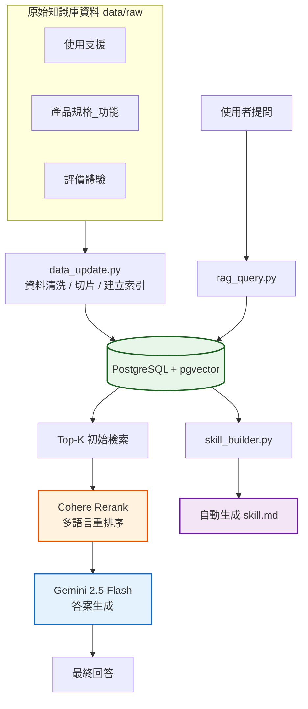
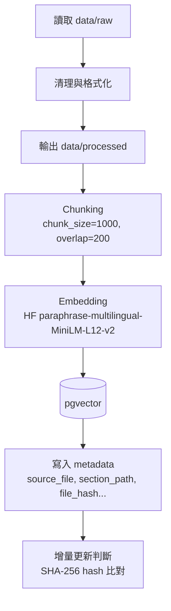
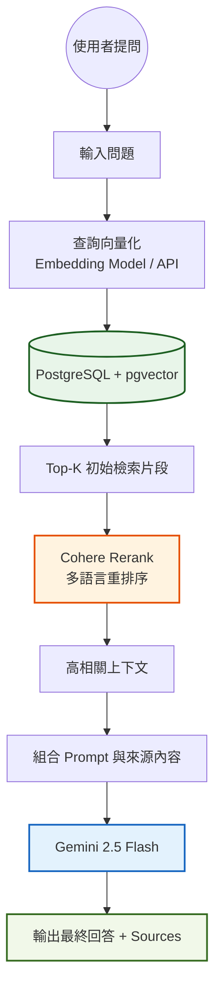
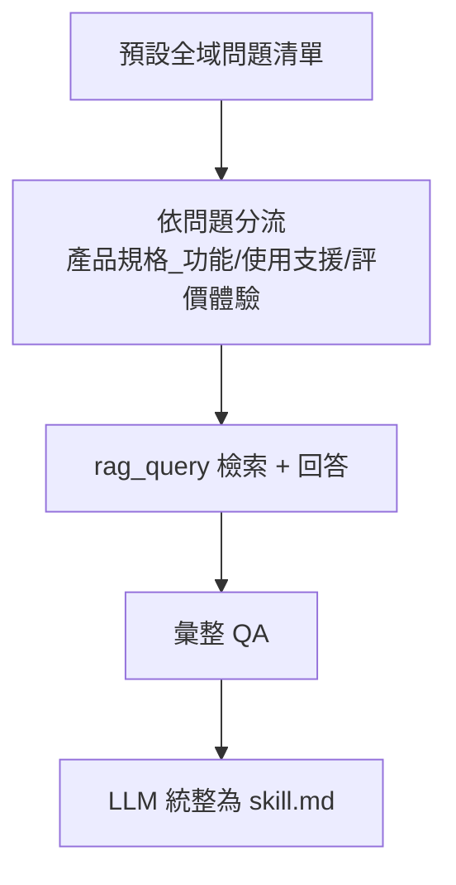

# Build Your Personal RAG — Oura Ring 4 知識庫

# 1. 專案簡介

### **1.1 選擇動機與市場觀察**
本專案主題定為 **「Oura Ring 4 智慧戒指功能特性與全方位使用支援指南」**。

**核心動機：**
* **台灣穿戴市場缺口**：觀察到台灣穿戴裝置市場高度集中於智慧手錶（如 Apple Watch, Garmin），相較於歐美市場，智慧戒指（Smart Ring）的普及率仍顯著偏低，而本專案旨在透過建立專業知識庫，探討此類「無感監測」裝置在台灣市場的推廣潛力與實用價值。
* **消除資訊不對稱**：智慧戒指品牌眾多，且深度技術文件與使用者評測多散落於國外社群，透過 RAG 系統整合多方資訊，能幫助台灣使用者快速跨越語言與資訊門檻，理解產品的核心功能。
* **特定品牌深耕**：鎖定目前全球市場佔有率最高、技術最成熟的 Oura Ring 4（排除已停產之舊版本），確保知識庫內容具備最新市場的參考價值。

> [網頁參考資訊]
> * [穿戴式裝置的下一階段：智慧戒指與健康資料的角色重組](https://www.ectimes.org.tw/2026/01/%E7%A9%BF%E6%88%B4%E5%BC%8F%E8%A3%9D%E7%BD%AE%E7%9A%84%E4%B8%8B%E4%B8%80%E9%9A%8E%E6%AE%B5%EF%BC%9A%E6%99%BA%E6%85%A7%E6%88%92%E6%8C%87%E8%88%87%E5%81%A5%E5%BA%B7%E8%B3%87%E6%96%99%E7%9A%84%E8%A7%92/) 
> * [比手錶更輕便！「智慧型戒指」將會是下個科技新趨勢！](https://www.esquire.tw/tab/524/id/38958)
> * [認識智能戒指 ｜ 優缺點、與智能手錶分別、Galaxy Ring 以外的選擇](https://hk.news.yahoo.com/what-is-smart-ring-buying-guide-063334956.html)


### **1.2 資料來源與組織架構**
為確保檢索的精準度，本專案將原始資料與清洗後的文字資料統一分類存放在以下三個結構化資料夾：

* **`使用支援/`**：包含設備設定、同步失敗排解、電池維護與充電疑難解答等常見問題文件。
* **`產品功能_規格/`**：涵蓋感測器技術原理（Smart Sensing）、硬體材質規格（鈦金屬/陶瓷）及各項生理指標（HRV, 準備度, 韌性）之定義。
* **`評價體驗/`**：收錄台灣本地科技媒體開箱、專業評測文章，以及國外社群真實反饋彙整。

**數據規模統計：**
* **總計文件數**：25 份。
* **文件格式**：24 份 Markdown (.md) 原始網頁資料、1 份經翻譯與重點擷取之國外評論彙整 Text (.txt)。
* **時間範疇**：資料涵蓋 2024 年至 2026 年 4 月。

### **1.3 RAG 系統架構與技術選型**
本系統採用目前業界針對「多國語言與繁體中文」優化程度最高的一套 API 組合，以確保回答的嚴謹性：

* **開發環境**：Python 3.12.4
* **向量化模型 (Embedding)**：透過 **Hugging Face API** 連接 `sentence-transformers/paraphrase-multilingual-MiniLM-L12-v2`。
    * *選型理由*：該模型在多語言語義空間中表現優異，特別針對繁體中文的語義理解進行調校，能精確處理中文內容。
* **重排序模型 (Rerank)**：採用 **Cohere `rerank-multilingual-v3.0`**。
    * *選型理由*：**針對中文語境深度優化**，在 RAG 流程中，單純的向量檢索容易因字面相似而產生誤解，而新增Cohere v3.0 能對初步檢索的片段進行二次深度語義比對，精確辨識出與問題真正相關的內容，顯著提升回答品質。
* **生成模型 (LLM)**：**Gemini 2.5 Flash**。
    * *選型理由*：利用其強大的邏輯推理與長文本總結能力，將重排序後的精華資訊轉化為結構清晰、專業且易讀的 `skill.md` 技能文件。


---

# 2. 系統架構（Mermaid）

### 2.1 整體架構圖（Block Diagram）


### 2.2 建庫流程圖（Data Pipeline）


### 2.3 推論檢索生成流程圖（RAG Query）


### 2.4 Skill Builder 流程圖（Knowledge Distillation）


---

# 3. 設計決策（Design Decisions）

以下為各技術節點的設計選擇與理由：

- **Chunking 策略**  
  - 採用固定長度切分（字元數），`chunk_size=1000`、`overlap=200`。  
  - 原因：資料多為長文網頁與支援文件，固定長度能穩定控制向量長度；overlap 可避免段落邊界資訊被切斷，提升檢索準確度。

- **Embedding 模型選擇**  
  - 使用 HuggingFace Inference API 的 `sentence-transformers/paraphrase-multilingual-MiniLM-L12-v2`（中文友善、多語言）。  
  - 原因：資料以中文為主，需更好的中文語意；HF API 可避免本地 Torch 依賴問題，部署與重現更容易。  
  - 中英混合處理：資料以中文為主，偶有英文名詞，此模型對中英混合語意較穩定。
  - 本地 vs 雲端API 取捨：本地速度快但 Windows 端 Torch 相依，設定複雜；雲端API 穩定性更高且免配置環境(個人已有金鑰故直接串接使用)。

- **Vector DB 選型**  
  - 使用 pgvector（PostgreSQL）。  
  - 原因：可用 SQL 查詢、 metadata 過濾、Docker 容易重現。  
  - 曾評估 ChromaDB / Qdrant，但考量作業驗證與 SQL 查詢彈性，最終採用 pgvector。

- **Metadata Schema 設計**  
  - `source_file`：來源檔案相對路徑，用於資料夾/來源過濾與來源引用顯示。  
  - `source_type`：檔案類型（md/txt），用於資料來源類型過濾。  
  - `chunk_index`：該檔案中的分段編號，用於引用定位。  
  - `file_hash`：原始檔案內容的 SHA‑256，供增量更新/冪等性判斷。  
  - `content`：chunk 文字內容，為語意檢索與回答依據。  
  - `original_title`：若原始資料含標題則保留，便於引用。  
  - `section_path`：章節路徑（如「大標題 > 小標題」），用於章節過濾與解釋上下文。  
  - `updated_at`：chunk 寫入時間，用於更新追蹤。  
  - `embedding`：向量欄位，用於相似度檢索。  

- **Retrieval 策略**  
  - `top-k=5` 作為預設。  
  - 支援 **reranking（Cohere）**：可手動開啟，用於改善檢索排序。  
  - 支援 **metadata 過濾**：可手動過濾 `source_prefix / source_type / section_contains`，用於聚焦特定資料夾（如產品規格_功能/使用支援/評價體驗）。

- **Prompt Engineering**  
  - 將 LLM 設定為「Oura Ring 健康穿戴裝置顧問」。  
  - 強制「只能根據參考內容回答、禁止臆測」，並要求輸出引用來源 `[編號]`。  
  - 遇到資料不足時需明確回答「資料不足」。

- **Idempotency 設計**  
  - 以檔案內容 `SHA-256` hash 判斷是否需要重建。  
  - 若 hash 未變 → 跳過；若 hash 改變 → 刪除該檔案舊資料後重建。  
  - 使 `data_update.py` 可重複執行且不會累積舊資料。

- **skill_builder.py 問題設計**  
  - 使用「全域問題」萃取核心知識，並加上更細的產品規格、功能指標、App 功能、使用支援、評價等問題。  
  - 依問題類型自動分流到不同資料夾（`產品規格_功能`、`使用支援`、`評價體驗`）提升精準度。  
  - 透過 reranking 提升檢索品質，讓 skill.md 更完整。

---

# 4. 環境設定與執行方式


### 4.1 Python 版本與虛擬環境

本專案要求 Python 3.10 以上，實際開發版本為 **3.12.4**。


```bash
# Step 0：確認 Python 版本（需 >= 3.10）
python3 --version

# Step 1：建立虛擬環境
python3 -m venv .venv

# Step 2：啟動虛擬環境
source .venv/bin/activate                # Linux / macOS
# .venv\Scripts\activate                 # Windows

# Step 3：安裝套件
pip install -r requirements.txt
```

### 4.2 Vector DB 啟動（docker-compose.yml）


本專案使用 `docker-compose.yml` 以 pgvector 啟動：

```yaml
version: "3.9"
services:
  db:
    image: pgvector/pgvector:pg16
    environment:
      POSTGRES_USER: ${POSTGRES_USER}
      POSTGRES_PASSWORD: ${POSTGRES_PASSWORD}
      POSTGRES_DB: ${POSTGRES_DB:-ragdb}
    ports:
      - "5433:5432"
    volumes:
      - ./docker/pgdata:/var/lib/postgresql/data   #使用相對路徑
```

啟動 Vector DB：

```bash
docker compose up -d
docker compose ps
```

### 4.3 環境變數設定

```bash
cp .env.example .env
# 請在 .env 中填入下列欄位：
# LITELLM_API_KEY / LITELLM_BASE_URL / HF_API_KEY
```

建議設定：
```
EMBEDDING_PROVIDER=huggingface
EMBEDDING_MODEL=sentence-transformers/paraphrase-multilingual-MiniLM-L12-v2
```

可選（使用 reranking 才需要）：
```
COHERE_API_KEY=your_cohere_api_key_here
```

### 4.4 全量重建索引

```bash
python data_update.py --rebuild --build-db --verbose
```

### 4.5 測試 RAG 問答

單次查詢：
```bash
python rag_query.py --query "Oura Ring 的材質是什麼？" --model gemini-2.5-flash
```

互動式多輪（至少 3 輪）：
```bash
python rag_query.py
```

可選功能（互動模式內）：
```
/rerank on               # 開啟 reranking（Cohere）
/rerank off              # 關閉 reranking
/filter prefix 產品規格_功能/   # 僅檢索指定資料夾
/filter type md          # 僅檢索指定檔案類型
/filter section 睡眠     # 僅檢索章節關鍵字
/filter clear            # 清除所有 filter（prefix/type/section）
/topk 5                  # 調整 top-k（預設 5）
/fetchk 20               # 調整初步候選數（rerank 時更有感）
/showcontext on          # 顯示檢索到的來源清單（除錯用）
```

> ⚠️ 目前不支援「單獨關閉某一個 filter」，如需關閉請使用 `/filter clear` 全部清除後再重新設定。

### 4.6 生成 skill.md

```bash
python skill_builder.py --output skill.md --model gemini-2.5-flash --rerank
```

補充：`skill_builder.py` 會自動提出全域問題並透過 `rag_query` 檢索，再統整為 `skill.md`。

### 4.7 完整執行流程（複現用）


```bash
# ① 確認 Python 版本
python3 --version        # 需顯示 >= 3.10.x

# ② 建立並啟動虛擬環境
python3 -m venv .venv
source .venv/bin/activate

# ③ 安裝套件
pip install -r requirements.txt

# ④ 設定環境變數
cp .env.example .env

# ⑤ 啟動 Vector DB（pgvector）
docker compose up -d
docker compose ps        # 確認 pgvector 狀態為 running

# ⑥ 全量重建索引
python data_update.py --rebuild --build-db

# （可選）只做資料清洗：輸出 data/processed，不寫入向量庫
python data_update.py --rebuild

# （可選）僅做後處理格式化：清理 Markdown 符號、表格與空白行
python data_update.py --post-process

# ⑦ 測試 RAG 問答
python rag_query.py --query "請問這個知識庫的核心主題是什麼？"

# ⑧ 生成 Skill 文件
python skill_builder.py --output skill.md
```

### 4.8 複現完整性檢查清單

可用以下指令逐一驗證：
```bash
# 1) 乾淨環境 clone 後依序執行
git clone <your_repo_url>

# 2) 檢查 docker-compose.yml 是否相對路徑
cat docker-compose.yml

# 3) 檢查 .env.example 是否存在且不含金鑰
cat .env.example

# 4) 檢查 requirements.txt 首行 Python 版本
head -n 1 requirements.txt

# 5) 檢查 processed 是否存在
ls data/processed

# 6) 重建索引並確認 DB 有資料
python data_update.py --rebuild --build-db
docker exec -it aiase2026-hw3-db-1 psql -U <user> -d <db> -c "SELECT COUNT(*) FROM rag_chunks;"

# 7) 測試問答是否含來源
python rag_query.py --query "請問這個知識庫的核心主題是什麼？"
```

- [x] 在全新目錄 `git clone` 後，能按照上述順序無誤執行所有指令  
- [x] `docker-compose.yml` 使用相對路徑  
- [x] `.env.example` 存在且不含真實金鑰  
- [x] `requirements.txt` 第一行有 Python 版本備註  
- [x] `data/processed/` 中有清理後的 `.txt` 檔案  
- [x] `python data_update.py --rebuild` 執行後無 Error，Vector DB 有資料  
- [x] `python rag_query.py --query "..."` 能回傳含引用來源的答案  

---

# 5. 資料來源聲明（Data Sources Statement）

| 來源名稱 | 類型 | 授權 / 合規依據 | 數量 |
|---|---|---|---|
| 官方網站資訊（使用支援 + 產品規格） | 網頁 / Markdown | 官方公開資訊 | 18 份 |
| 評測文章（國內評測） | 網頁 / Markdown | 公開評測內容 | 6 份 |
| 使用者體驗報告（國外彙整） | 文字整理（由網頁翻譯彙整） | 公開評論與心得 | 1 份 |

---

# 6. 系統限制與未來改進
### 6.1 系統限制與設計決策 (System Scope & Design Decisions)
- 高品質知識庫資料蒐集：目前的知識庫並非盲目抓取大量網頁，而是由開發者精選自 Oura 官方技術手冊與權威深度評測，此「高純度資料集」的設計決策，旨在確保 RAG 系統在生成回答時具備極高的事實準確度，避免低品質雜訊干擾生成的穩定性。

- 高透明度進階模式 (Advanced Control Mode)：系統目前將 Reranking 與 Metadata 過濾 設為手動觸發模式，這是有意為之的技術展示，旨在讓使用者能直觀比較「基礎向量檢索」與「進階多重排序」在語義理解上的差異，不僅是一個功能，更是作為 RAG 實驗與品質判斷的工具箱。

### 6.2 未來改進方向 (Future Roadmap)
- 由「手動控制」轉向「Agentic RAG」：未來規劃引入 自主代理 (AI Agent) 機制，使系統能根據使用者問題的複雜度，自動判斷是否需要呼叫 Cohere Rerank 進行重排序或自動執行多步推理（Multi-step Reasoning）來解決跨文檔的複雜提問。

- 多模態 RAG (Multimodal Integration)：預計整合 Oura Ring 4 的硬體結構圖、影片評測（YouTube 語音轉文字）等視覺與音訊資料，讓系統不僅能「讀懂」文字，更能透過多維度資訊解讀產品細節。

- GraphRAG (圖譜增強檢索)：計畫導入知識圖譜 (Knowledge Graph)，將「HRV、準備度、體溫」等生理指標建立因果關聯，當使用者詢問複合指標時，系統能透過圖路徑提供更深層次的健康洞察，而不僅是片段文字的檢索。

- 動態實時數據對接：未來擬探索與 Oura App API 或即時科技趨勢新聞的對接，實現「動態上下文注入 (Dynamic Context Injection)」，確保知識庫能隨官方軟體更新而即時同步，保持系統的長效生命力。
